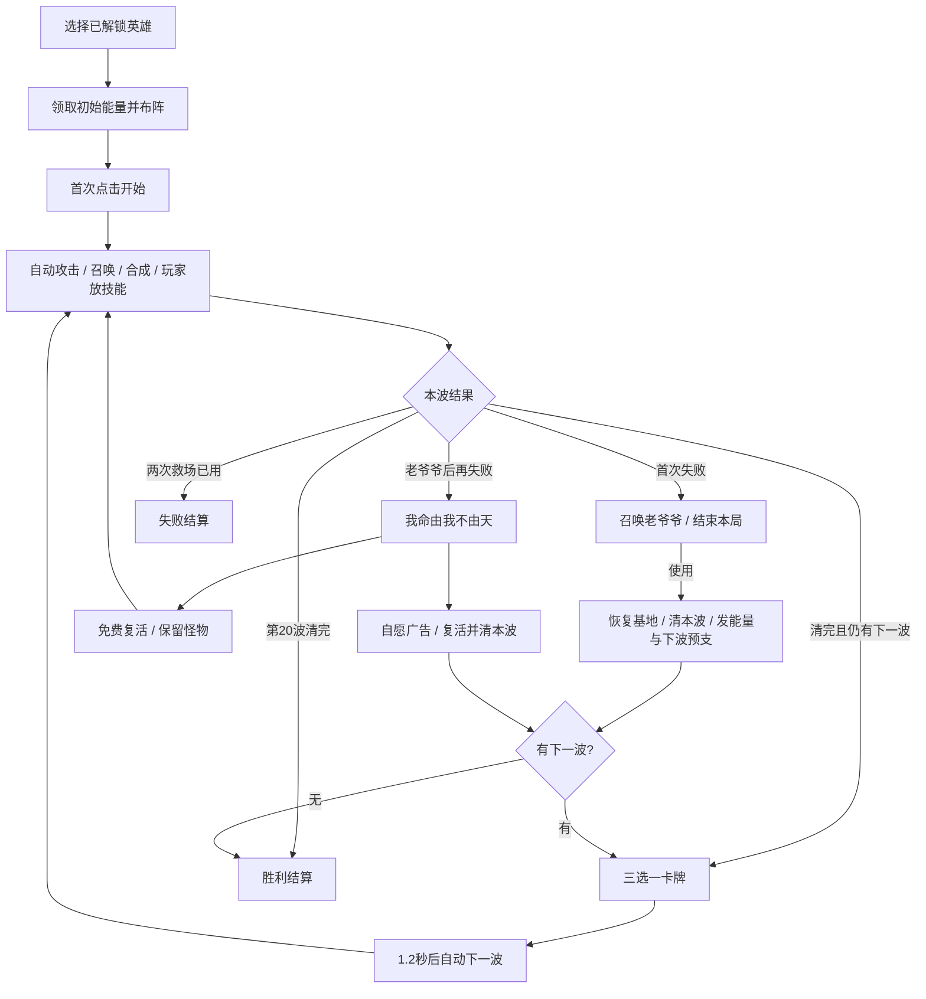

# 游戏玩法设计说明书

版本 v0.7 · 2026-09-13。规则来源见[设计基线](设计基线与决策记录.md)，边界与结算以[系统规则](系统规则与边界.md)为准。保留v0.6恒速、射程与奖励，本轮增加选卡后自动开波、布阵慢动作、5/10/15波小Boss、20波大Boss，并强化打击表现及数值排版。

## 1. 产品定位

零充值、魔性英雄放置塔防。玩家持续召唤和合成英雄，借助肉鸽卡牌形成技能联动，择机释放手动大招，经历从稀疏阵容到满屏连锁的成长。

目标发布平台仅为微信小游戏（2026-09-17 用户确认，见设计基线 D030）；目标体验为单手可玩、自动作战、清楚的战术选择。放置指英雄自动攻击与施放自身技能；原型不增加离线收益和长周期挂机经济。

本作包含一个自愿激励广告分支：第二次失败时，免费复活和广告清屏复活并列提供。普通开局、关卡、召唤、合成、英雄解锁均不要求广告或充值。

## 2. 一局流程

正常20波；标准流程1×目标6～10分钟、2×目标3～5分钟。倍速可随时在战斗中切换，怪物数量、波次、生命、单次伤害与奖励完全相同。

第5、10、15波各有一只逐步增强的小Boss，第20波为大Boss。普通怪仍8只起每波+2，Boss额外加入。选英雄召唤或移动/合成时进入0.2倍慢动作，放置完成或取消后恢复所选速度；查看英雄射程不改变速度。技能瞄准、选卡、设置和后台仍暂停，免费复活后保留准备按钮。

## 3. 布阵与战斗

原型建议竖屏720×1280逻辑画布。怪物从画面上方沿3条路线前进，突破底部防线扣基地耐久。英雄站在路线旁固定位置，各路线3位；范围、攻击类型与站位决定有效覆盖。英雄本体不因接触怪物死亡。

开局从已解锁英雄中选择最多4个种类。初始3位基础英雄，第四位按攻略或夸赞作者解锁；具体默认名单见内容表。已带入的种类可重复召唤。

玩家点击英雄图标，再点击空位或待部署位完成召唤。没位置时不扣能量，允许先合成或调整。战间免费换位；战斗中允许换位、召唤和合成，但相关攻击进度不因操作重置获利。

3个待部署位作为正式备战区：英雄在其中不战斗，可合成和与场上英雄交换。全部12位占满而无可合成配对时，仍能交换调整和继续防守，已获得能量保留。详细规则见系统第9节。

一般英雄优先攻击本范围内最接近基地的怪物；专职精英英雄按明确优先级选择精英。选中英雄显示范围及目标偏好，让漏怪原因可理解。

## 4. 能量与合成

初始能量120，召唤任一一星英雄40，均为待实测起始值。普通收入来自击杀怪物。英雄可两两合成，同名且同星才合法：1星+1星→2星，2星+2星→3星。

升星同时提升能力与技能表现。两个副本形成一个新副本，释放一个格位；系统在确认前展示升星结果。最高3星，同星最高阶不再继续合成。英雄强化卡跟随种类，作用于所有现有及后来召唤的副本。

不加入出售返还或随机召唤系统。能量紧张时依靠位置、卡牌与技能决策；救场固定补给为明确例外。

## 5. 三星技能与玩家技能库

某英雄在本局第一次合成至三星，立即解锁该英雄的大招，并给出一次可装备提示。技能由玩家主动释放。之后同名英雄再次升至三星不重复给大招、不刷新次数或冷却。

本局拥有独立技能库，来源包括英雄三星与波次卡牌。界面同时装备2个技能；空槽可直接装备，满槽时新技能先进入库，波间免费换装。更换技能保留各自冷却，避免反复换装连续放大招。

新解锁技能首次可直接使用，之后按各自战斗时间冷却。不耗召唤能量；冷静波照常可用。已经获得的技能在本局保持解锁，下一局重置。

## 6. 波次卡牌与构筑

第1～19波完成后，游戏暂停并提供三选一。三张都须有合法效果且同页不重复；英雄专属卡只针对本局带入的种类。第20波完成后直接结算。

选卡与波间部署时提供下一波主要怪物和路线预告，支持玩家有依据地调整。首次操作引导、可合成提示及结算回顾见[体验补充与新手引导](体验补充与新手引导.md)。

卡牌分为英雄强化、跨英雄联动、玩家主动技。优先创造新的攻击形态和组合，而非大量小幅属性叠加。已满级或无合法效果的卡不占候选；重复主动技能卡按配置转为该技能强化，且说明效果。

核心例子：音波减速→拳套聚怪→玉米标记→死亡连爆→拖鞋收割精英。玩家既能沿一个组合深入，也能围绕新卡形成另一种打法。

## 7. 两阶段救场

第一次基地归零可使用“召唤老爷爷”，每局一次。他清除本波全部未结算敌人，恢复基地，并立刻发放这些敌人的基础能量，以及下一波完整基础怪物能量。下一整波进入冷静期，怪物不再给能量，波次结束恢复。

再次失败出现“我命由我不由天”，每局一次。免费选择=复活和固定能量，保留战场怪物；自愿看完广告=相同复活与固定能量，再清整波。两路共用该次机会。此后再次失败结算。

广告行为只用于该明确额外奖励；点击按钮时才展示。免费分支给安全布阵窗口，能恢复正常战斗。详细的末波、广告取消、冷静波、漏怪和发奖规则见系统文档。

## 8. 英雄解锁与长线目标

英雄都能通过首次通关、累计过波、英雄挑战等免费攻略目标解锁，条件在图鉴可见。每个锁定英雄另提供游戏内夸赞作者入口，选一句原创玩笑台词后立刻永久获得该英雄；允许通过此入口提前获得全部英雄。

夸赞互动全部在游戏内完成，无需对外分享、关注、好评或人工审核。正式英雄阵容没有付费稀有度梯度。首版目标为通关一次标准20波、解锁4位英雄并收集其等级形态，完成后可自由重玩。新章节、英雄挑战、流派记录和特殊成就作为后续内容，不自动出现在首版，也不以每日任务维持强制刷取。

原型只验证4位英雄和1张20波地图。卡牌、局内能量、星级、救场次数随新局重置；英雄解锁、永久等级、训练经验余额、已拥有及所选形态、攻略进度、设置与图鉴保留。进行中的一局应能在中断后恢复。

局外循环为：完成波次获得训练经验→营地选择英雄→升级永久等级与数值→解锁或切换形态并预览动作→选择出战英雄→开始新局。Lv3不是三星；永久等级不提前给K系技能。新局锁定带入英雄的等级与形态快照，继续旧局不受之后的养成调整影响。详细规则与建议参数见[局外英雄养成与界面方案](局外英雄养成与界面方案.md)。

## 9. 魔性表现

原创圆润玩具风，英雄的夸张动作与能力一致；怪物有不同轮廓和节奏。爆炸、击退与定身有统一视觉语义。老爷爷出场配拐杖和短促乐句，冷静波播放木鱼变奏，第二救场有独立演出。

2×时战斗视觉跟随战斗时间，音乐与人声保持正常速度；音效通过并发与优先级控制密度。关闭音频不影响危险识别。详细规格位于[美术](../../assets/art/README.md)与[音频](../../assets/audio/README.md)。

## 10. 本轮交付边界

玩法、原型参数JSON与固定种子刷怪样例、完整界面操作契约、首版范围/试玩标准、小样验收计划和编码交接均已整理。当前已形成[14种代表画面](../../assets/art/03_candidates/ui/screen-set-v001/preview-gallery.html)，其中新增6种局外预览；全部待用户确认。没有可运行游戏、实机性能或可玩性测试结果，正式运行时图音仍待制作。技术实现按后续独立会话推进。
